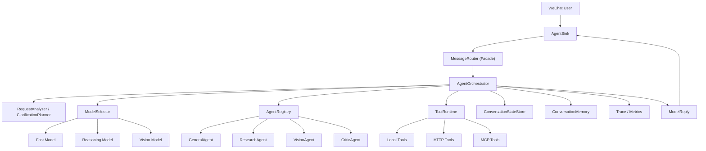
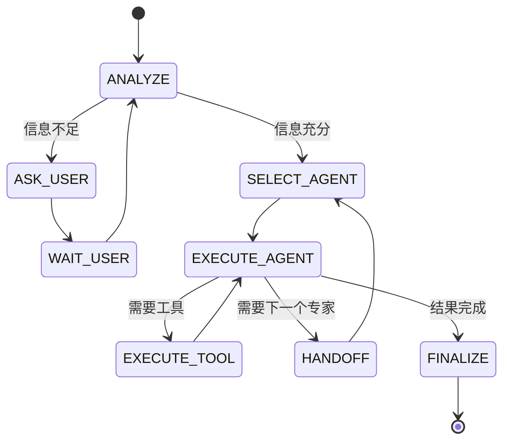

# 基于当前项目的多模型编排与多 Agent 协作架构方案

## 1. 目标

你想要的不是“再接一个模型”这么简单，而是一套可以持续扩展的协作框架：

1. 用户发来需求后，主模型先理解问题，而不是立刻回答。
2. 当信息不完整时，主模型可以主动追问用户。
3. 主模型可以基于任务类型、模态、成本和质量要求，选择最合适的子模型或子 Agent。
4. 子 Agent 处理后，既可以直接产出答案，也可以继续把任务移交给下一个 Agent。
5. 后续要能自然接入 tools，而不是做完多 Agent 再推倒重来。

结合当前仓库的实现，我推荐采用一套 **Supervisor-first 的混合编排架构**：

- 默认由主编排器统一掌控流程。
- 专家 Agent 负责执行具体任务。
- Tool 调用走统一契约。
- Handoff 允许发生，但必须经过主编排器记录和裁决。

这比完全自由的“Agent 互相对话”更稳，更适合接到你现在这套 Spring Boot + WeChat iLink 的工程里。

---

## 2. 调研结论：Agent 和多 Agent 的核心理念

### 2.1 先做工作流，再做自治

公开实践里一个非常一致的结论是：**不要一开始就做完全开放式自治 Agent**。

- Anthropic 在 [Building effective agents](https://www.anthropic.com/engineering/building-effective-agents?via=aitoolhunt) 里强调，很多问题先用简单、可控的 workflow 就能解决，只有在确实需要时再引入更强自治。
- OpenAI 在 [A practical guide to building AI agents](https://openai.com/business/guides-and-resources/a-practical-guide-to-building-ai-agents/) 里也把 agent 拆成“模型 + 指令 + 工具 + 编排”这几个基础件，而不是鼓励一上来做无限循环的智能体。

对这个项目的含义是：

- 先把“理解需求 -> 追问 -> 选模型/选 Agent -> 调工具 -> 输出结果”这条主链打通。
- 不建议一开始做完全去中心化的 Agent 网络。
- 主编排器应始终保留最终决策权、预算控制权和对外回复权。

### 2.2 Tool 使用是 Agent 落地的第一能力

- ReAct 论文 [ReAct: Synergizing Reasoning and Acting in Language Models](https://openreview.net/forum?id=WE_vluYUL-X) 证明了“推理 + 行动 + 观察结果再推理”的循环对复杂任务非常有效。
- OpenAI 官方对 [Function Calling / Structured Outputs](https://help.openai.com/en/articles/8555517-function-calling-updates) 的建议，本质上也是把模型输出约束成结构化工具调用。

对这个项目的含义是：

- Tool 不应是多 Agent 之后才加的附属品，而应是整个编排架构的底座。
- 主模型和子 Agent 都要共享同一套 Tool 契约。
- 只要 Tool 契约设计稳，后续接本地工具、HTTP 工具、MCP 工具都不会推翻上层架构。

### 2.3 多 Agent 不是“越多越好”，而是“角色边界要清晰”

- Microsoft 的 [AutoGen](https://www.microsoft.com/en-us/research/publication/autogen-enabling-next-gen-llm-applications-via-multi-agent-conversation-framework/) 展示了多 Agent 会话框架的价值。
- CAMEL 与 MetaGPT 这类工作进一步说明：多角色协作确实能提升复杂任务表现，但前提是角色职责、输入输出契约和交接规则足够清晰。

对这个项目的含义是：

- 不要把每个模型都当成“万能 Agent”。
- 应该让 Agent 成为“一个明确职责 + 一组可用工具 + 一个偏好的模型配置”的组合。
- Agent 之间不要自由漫游，应该通过标准化 `handoff` 协议协作。

### 2.4 上下文是有限资源，必须分层管理

- Anthropic 的 [Effective context engineering for AI agents](https://www.anthropic.com/engineering/effective-context-engineering-for-ai-agents) 强调：上下文是关键但有限的资源。

对这个项目的含义是：

- 不能把所有对话历史、所有 Tool 结果、所有子 Agent 输出都无脑塞给下一个模型。
- 需要区分“用户会话记忆”“当前执行工作记忆”“长期事实/摘要记忆”。
- 主编排器要负责做上下文压缩、摘要和 artifact 引用，而不是简单堆 token。

---

## 3. 当前项目为什么适合扩展

你现在这套代码其实已经有了一个很好的起点。

### 3.1 现有入口已经集中

当前主链路大致是：

```text
WeChat Message
  -> AgentSink
  -> MessageRouter
  -> IntentRecognizer / AiModelClient / ImageGenClient / TTS
  -> ModelReply
  -> WeChat iLink
```

这意味着：

- 用户消息入口只有一个，适合插入统一编排器。
- 输出回微信的出口也只有一个，适合统一控制最终回复。
- 现有图像、语音能力已经天然具备“专家能力”雏形。

### 3.2 现有代码的可复用价值很高

| 当前组件 | 当前职责 | 未来建议职责 |
|---|---|---|
| `AgentSink` | WeChat 消息接入、多模态预处理、回包 | 保持不变，继续做输入输出边界层 |
| `MessageRouter` | 意图识别后路由 chat / image / speech | 演进为外观层，内部委派给 `AgentOrchestrator` |
| `IntentRecognizer` | 轻量意图分类 | 演进为 `RequestAnalyzer` / `ClarificationPlanner` 的前置能力 |
| `AiModelClient` | 调用单个聊天模型 | 演进为多模型统一调用接口或 `ModelClientRegistry` |
| `ConversationMemory` | 原始对话历史 | 保留，并新增执行态 `ConversationStateStore` |
| `ImageGenClient` / `TextToSpeechClient` | 专项能力 | 变成内建 Tool 或 Specialist Agent 背后的执行器 |

### 3.3 当前架构里最值得尽快改的一点

目前 `AiModelClient` 返回的是纯 `String`，这对普通聊天够用，但对多 Agent 和 Tool 来说不够。

后续如果要支持：

- 工具调用
- 结构化输出
- handoff 指令
- 中间摘要
- 置信度
- 多段结果

就需要把模型返回值从“纯文本”升级成“结构化响应对象”。

这是整个后续演化里最关键的接口升级点之一。

---

## 4. 推荐的目标架构

## 4.1 总体思路

推荐采用 **主编排器 + 专家 Agent + 统一 Tool Runtime + 分层记忆** 的模式。



### 4.2 为什么推荐这个模式

这个模式比“完全对等的多 Agent 群聊”更适合生产：

- 对外只有一个脑，用户体验稳定。
- 对内可以多模型协作，能力扩展灵活。
- 所有工具调用、handoff、预算、日志都在中心层可观测。
- 未来接 MCP、数据库、检索、任务队列时，不需要推翻入口层。

---

## 5. 推荐的交互模式

## 5.1 主模式：Supervisor + Handoff Hybrid

我建议默认采用下面这套交互模型：

1. `RequestAnalyzer` 先理解用户需求，并判断当前信息是否充分。
2. 如果信息不足，返回 `ASK_USER`，主编排器向用户追问。
3. 如果信息足够，`ModelSelector` 选择最合适的 Agent 和模型。
4. 专家 Agent 执行任务。
5. 专家 Agent 可以：
   - 直接输出最终结果 `FINAL`
   - 调用工具 `TOOL_CALL`
   - 请求移交给下一个 Agent `HANDOFF`
   - 请求主编排器向用户追问 `NEED_USER_INPUT`
6. 主编排器决定是否接受 handoff、是否继续循环、是否结束回复。

这正好对应你想要的：

- 主模型先理解问题
- 主模型能追问用户
- 主模型能选子模型
- 子模型可继续调下一个模型
- 子模型也可直接答复

## 5.2 不建议的模式

### 完全自由的 Agent 自治聊天

不建议一开始就做：

- A 觉得该给 B
- B 又给 C
- C 再找 A
- 所有 Agent 共用一长串上下文

这样非常容易出现：

- 死循环
- 成本不可控
- 调试困难
- Tool 权限失控
- 最终输出口径不稳定

---

## 6. 核心状态机



建议所有内部执行状态都显式化，不要只靠 prompt 和 if/else 隐式维护。

---

## 7. 核心抽象设计

## 7.1 编排决策对象

建议增加一个结构化的规划结果，而不是让主模型直接吐纯文本：

```java
public record PlannerDecision(
        OrchestrationAction action,
        String normalizedGoal,
        List<String> clarificationQuestions,
        String targetAgent,
        String targetModel,
        List<String> suggestedTools,
        List<String> successCriteria,
        int maxSteps
) {}
```

其中 `action` 建议包含：

- `ASK_USER`
- `DELEGATE`
- `RESPOND_DIRECTLY`
- `REJECT`

## 7.2 Agent 输入输出契约

```java
public record AgentTask(
        String conversationId,
        String parentStepId,
        String agentName,
        String modelName,
        String goal,
        String userMessage,
        Map<String, Object> context,
        List<String> allowedTools,
        int remainingSteps
) {}

public record AgentOutcome(
        AgentStatus status,
        String summary,
        String finalAnswer,
        String handoffAgent,
        String handoffReason,
        List<ToolCallRequest> toolCalls,
        List<String> clarificationQuestions,
        Map<String, Object> artifacts,
        double confidence
) {}
```

其中 `status` 建议包含：

- `FINAL`
- `TOOL_CALL`
- `HANDOFF`
- `NEED_USER_INPUT`
- `FAILED`

## 7.3 Tool 契约

这是后续丝滑对接 tools 的关键：

```java
public record ToolDefinition(
        String name,
        String description,
        Map<String, Object> inputSchema,
        boolean requiresApproval,
        ToolExecutor executor
) {}

public record ToolCallRequest(
        String toolName,
        Map<String, Object> arguments
) {}

public record ToolResult(
        String toolName,
        boolean success,
        String text,
        Map<String, Object> data
) {}
```

核心原则：

1. Tool 定义独立于具体模型厂商。
2. Tool 输入输出必须结构化。
3. Tool 结果必须可被记录、摘要和复用。
4. Tool 权限与预算控制不应放在 prompt 里，而应放在运行时。

## 7.4 模型抽象

建议不要继续把所有调用都压在 `AiModelClient.chat(String, ...)` 上，而是升级为更通用的调用对象：

```java
public record ModelInvocationRequest(
        String model,
        List<ChatRequest.Message> messages,
        List<ToolDefinition> tools,
        String toolChoice,
        String responseSchema,
        boolean stream,
        Map<String, Object> metadata
) {}

public record ModelInvocationResponse(
        String text,
        List<ToolCallRequest> toolCalls,
        Map<String, Object> structuredOutput,
        String finishReason,
        int promptTokens,
        int completionTokens
) {}
```

这样未来无论是：

- OpenAI 兼容 function calling
- 严格 JSON schema 输出
- 并行 tool calls
- handoff 指令

都能在接口层承接。

---

## 8. 建议的包结构

```text
src/main/java/com/youkeda/project/wechatproject/agent/
├─ AgentAutoConfiguration.java
├─ AgentSink.java
├─ routing/
│  ├─ MessageRouter.java
│  ├─ ModelReply.java
│  └─ AgentOrchestratorFacade.java
├─ orchestration/
│  ├─ AgentOrchestrator.java
│  ├─ RequestAnalyzer.java
│  ├─ ClarificationPlanner.java
│  ├─ ModelSelector.java
│  ├─ ConversationState.java
│  ├─ ConversationStateStore.java
│  ├─ PlannerDecision.java
│  ├─ AgentTask.java
│  ├─ AgentOutcome.java
│  ├─ HandoffDecision.java
│  └─ ExecutionPolicy.java
├─ model/
│  ├─ ModelCatalog.java
│  ├─ ModelProfile.java
│  ├─ ModelClientRegistry.java
│  ├─ ModelInvocationRequest.java
│  ├─ ModelInvocationResponse.java
│  └─ OpenAiChatModelClient.java
├─ specialists/
│  ├─ SpecialistAgent.java
│  ├─ AgentDefinition.java
│  ├─ AgentRegistry.java
│  ├─ GeneralAgent.java
│  ├─ ResearchAgent.java
│  ├─ VisionAgent.java
│  ├─ CriticAgent.java
│  └─ SpeechAgent.java
├─ tools/
│  ├─ ToolDefinition.java
│  ├─ ToolRegistry.java
│  ├─ ToolExecutor.java
│  ├─ ToolRuntime.java
│  ├─ ToolCallRequest.java
│  ├─ ToolResult.java
│  ├─ local/
│  ├─ http/
│  └─ mcp/
├─ memory/
│  ├─ ConversationMemory.java
│  ├─ InMemoryConversationMemory.java
│  ├─ WorkingMemoryAssembler.java
│  ├─ ArtifactStore.java
│  └─ SummaryMemoryStore.java
└─ trace/
   ├─ ExecutionTrace.java
   ├─ StepTrace.java
   └─ MetricsRecorder.java
```

---

## 9. 和当前代码的具体映射关系

## 9.1 `MessageRouter` 不要直接废掉

最稳妥的做法不是删掉 `MessageRouter`，而是让它变成一个 facade：

```text
MessageRouter.route(...)
  -> AgentOrchestrator.handle(...)
  -> 如果多 Agent 未开启，则 fallback 到当前单模型逻辑
```

这样有几个好处：

- 兼容现有入口
- 风险小
- 可以灰度开关
- 便于逐步迁移

## 9.2 `IntentRecognizer` 不要消失，改成前置分析能力

当前 `IntentRecognizer` 已经有价值，但不应继续承担全部路由责任。

建议演进方向：

- `RegexIntentRecognizer` 保留为兜底。
- `LlmIntentRecognizer` 演进为 `RequestAnalyzer` 的轻量版本。
- 后续再增加 `ClarificationPlanner`，把“是否追问”“缺什么信息”“应该交给谁”都做成结构化决策。

## 9.3 `AiModelClient` 先兼容，再升级

建议保留老接口用于兼容现有逻辑，但新增新接口：

```java
public interface ModelClient {
    ModelInvocationResponse invoke(ModelInvocationRequest request) throws IOException;
}
```

然后让现有 `OpenAiCompatibleClient` 通过适配器方式接到新接口上。

## 9.4 图像和语音能力的归位

现有图像和语音能力建议这样归位：

- `ImageGenClient`：优先变成 `generate_image` 工具。
- `TextToSpeechClient`：优先变成输出后处理能力，或 `text_to_speech` 工具。
- `SpeechToTextClient`：继续保留在入口层，也可以作为 `speech_to_text` 工具复用。

这比把它们继续塞在“特殊路由分支”里更容易扩展。

---

## 10. 推荐的 Agent 角色设计

第一版不要设计太多 Agent，建议只上 4 个：

### 10.1 Planner / Supervisor Agent

职责：

- 理解用户需求
- 判断是否需要追问
- 选择后续专家 Agent
- 审核 handoff
- 控制循环步数、预算和最终回复

推荐模型特性：

- 快
- 结构化输出稳定
- 成本低

结合你当前项目，可以先让它沿用现有 intent 模型配置思路，例如使用当前已接入的轻量模型角色。

### 10.2 General Agent

职责：

- 处理普通问答
- 处理无需外部工具的一般任务
- 组织最终文案

推荐模型特性：

- 综合能力强
- 文本表现稳定

### 10.3 Vision / Multimodal Agent

职责：

- 理解图片
- 判断图片相关任务是否应走图像问答、图像生成或视觉分析

结合当前项目，这一层可以直接复用现有多模态模型能力。

### 10.4 Critic / Reviewer Agent

职责：

- 对关键输出做质量检查
- 对高风险工具结果做二次确认
- 在需要时做“给用户前的最后一跳”

这个 Agent 不必默认每次都跑，可以作为高风险任务的可选步骤。

---

## 11. 模型选择策略

模型选择不要写死在 prompt 里，应该做成运行时策略。

建议引入：

```java
public record ModelProfile(
        String name,
        Set<String> capabilities,
        int maxContextTokens,
        double costWeight,
        double latencyWeight,
        boolean supportsVision,
        boolean supportsToolCalling,
        boolean supportsStructuredOutput
) {}
```

选择维度建议包含：

- 任务类型：问答、规划、图像、语音、审查
- 是否需要多模态
- 是否需要严格结构化输出
- 是否需要工具调用
- 延迟目标
- 成本预算

推荐的路由逻辑：

1. 能用快模型解决时，不上强模型。
2. 需要结构化输出时，优先选结构化稳定的模型。
3. 需要看图时，直接进多模态模型。
4. 只有在质量要求高或普通 Agent 不确定时，再升级到更强模型。

---

## 12. 为 Tools 和 MCP 做的架构预留

## 12.1 Tool Runtime 必须独立

后续如果你想丝滑接 tools，最重要的不是 prompt，而是独立的 `ToolRuntime`：

```java
public interface ToolRuntime {
    ToolResult execute(String conversationId, ToolCallRequest request);
}
```

它至少要支持三类执行器：

- `LocalToolExecutor`：本地 Java 代码工具
- `HttpToolExecutor`：调用外部 HTTP API
- `McpToolExecutor`：对接 MCP Server

## 12.2 Tool 发现与模型协议适配分开

建议分成两层：

1. **Tool Registry**
   - 负责注册、查找、权限和 schema
2. **Model Tool Adapter**
   - 负责把内部 `ToolDefinition` 转换成不同模型厂商需要的 tools/function schema

这样后续无论你接：

- OpenAI 兼容 function calling
- 阿里云兼容接口
- 其他模型厂商
- MCP tools

都只需要写 adapter，不需要改 orchestrator 逻辑。

## 12.3 MCP 建议作为“工具来源”，不是“调度中心”

参考 [Model Context Protocol 官方规范](https://modelcontextprotocol.io/specification/2025-06-18/server/tools)，MCP 很适合作为 tool 的统一接入标准。

但在这个项目里，我建议：

- 主编排器仍然在你自己的 Java 服务里。
- MCP Server 作为外部工具提供方。
- 不让 MCP 反过来控制核心调度流程。

这样边界最清楚：

- 编排在你手里
- 工具可以外接
- 未来换供应商成本低

---

## 13. 记忆与状态设计

当前 `ConversationMemory` 更像“原始对话历史”。

多 Agent 场景下，建议拆成三层：

### 13.1 会话记忆

保留当前 `ConversationMemory`：

- 用户说过什么
- 系统回过什么

### 13.2 执行态状态

新增 `ConversationStateStore`，用于存：

- 当前目标
- 当前计划
- 已追问问题
- 当前活跃 Agent
- 当前剩余步数
- 已执行 tool calls
- 已产生 artifacts

### 13.3 摘要/长期记忆

新增可选摘要层：

- 把长对话压缩成结构化摘要
- 只把真正有用的事实喂给下一轮

这个阶段先做内存实现即可，后续可以迁到 Redis / DB。

---

## 14. 推荐的数据流

```text
1. 用户消息进入 AgentSink
2. AgentSink 负责文本/图片/语音预处理
3. MessageRouter 调用 AgentOrchestrator
4. RequestAnalyzer 产出 PlannerDecision
5. 如果需要追问，直接返回追问内容给用户
6. 如果需要委派，ModelSelector 选择 Agent + 模型
7. SpecialistAgent 执行
8. 若出现 tool calls，则交给 ToolRuntime
9. 若出现 handoff，则回到 orchestrator 审核后进入下一个 Agent
10. 结果汇总为 ModelReply，由 AgentSink 回微信
```

关键原则：

- 只有 `AgentSink` 负责和微信通道交互
- 只有 `AgentOrchestrator` 负责多 Agent 决策
- 只有 `ToolRuntime` 负责执行工具
- 只有 `ModelReply` 负责最终外部输出封装

---

## 15. 分阶段落地建议

## Phase 0：先做接口抽象，不改变外部行为

目标：

- 不改变用户体验
- 先把未来扩展点铺好

建议动作：

1. 新增 `ModelInvocationRequest/Response`
2. 新增 `ModelClientRegistry` 和 `ModelProfile`
3. 让 `MessageRouter` 内部可以选择走旧逻辑或新 orchestrator
4. 新增 `ConversationStateStore`

这是最值的一步，因为它决定后面是不是能丝滑演进。

## Phase 1：实现“主模型追问 + 选模型”

目标：

- 让主模型具备你要的“先理解、再追问、再分配”

建议动作：

1. 新增 `RequestAnalyzer`
2. 新增 `PlannerDecision`
3. 新增 `PlannerAgent`
4. 把当前 `IntentRecognizer` 作为 analyzer 的 fallback

完成这一步后，你就已经拥有“主模型编排”的雏形了。

## Phase 2：接入统一 Tool Runtime

目标：

- 把 image/speech 之外的未来 tools 接进来

建议动作：

1. 新增 `ToolDefinition` / `ToolRegistry` / `ToolRuntime`
2. 扩展 `ChatRequest` 支持 `tools`、`tool_choice`
3. 让模型返回 `toolCalls`
4. 先接 2 到 3 个简单工具验证循环

建议优先做：

- `generate_image`
- `speech_to_text`
- `text_to_speech`

这样能最大化复用你现有能力。

## Phase 3：引入 2 到 4 个 Specialist Agents

目标：

- 从“一个主模型 + 工具”升级到“主模型 + 专家 Agent”

建议动作：

1. 新增 `AgentRegistry`
2. 实现 `GeneralAgent`
3. 实现 `VisionAgent`
4. 实现 `CriticAgent`
5. 加 `HANDOFF` 协议和最大移交深度限制

## Phase 4：补观测性和评测

目标：

- 让系统能稳定维护

建议动作：

1. 增加 step trace
2. 记录每轮选择了哪个模型、为什么
3. 记录 tool call 成功率、耗时和错误率
4. 建立固定测试集和回归评测

---

## 16. 关键风险与保护措施

### 16.1 风险：无限 handoff / 无限循环

保护措施：

- 配置 `maxSteps`
- 配置 `maxHandoffs`
- 超限时强制进入总结回复

### 16.2 风险：上下文爆炸

保护措施：

- 工作记忆和长期记忆分离
- Tool 结果摘要化
- 子 Agent 只传 artifact 引用，不传所有原文

### 16.3 风险：Tool 权限失控

保护措施：

- Tool 白名单
- Agent 级 allowedTools
- 高风险工具显式审批

### 16.4 风险：不同模型返回格式不稳

保护措施：

- 尽量使用结构化输出 / schema
- adapter 层做兼容
- fallback 到纯文本模式

### 16.5 风险：最终口径不一致

保护措施：

- 最终对外回复始终由 orchestrator 统一封装
- 对关键任务增加 critic 审核步骤

---

## 17. 我对这个项目的最终建议

如果目标是“尽快做出一个真实可用的多模型协作版本”，我最推荐的不是直接实现一个庞大的 multi-agent framework，而是按下面的顺序：

1. 先把 `MessageRouter` 背后换成可扩展的 `AgentOrchestrator`。
2. 先把模型调用返回值升级成结构化响应对象。
3. 先实现主模型的 `ASK_USER / DELEGATE / RESPOND_DIRECTLY` 三种动作。
4. 再统一 Tool Runtime。
5. 最后再加 handoff 和 critic。

这个顺序最贴合你现在的工程，也最能保证后续 tools、MCP 和更多模型接入时不返工。

一句话概括这套方案：

> **用一个可控的主编排器守住流程、状态和权限，用多个职责清晰的子 Agent 扩展能力，用统一 Tool Runtime 作为未来一切外部能力的接入面。**

---

## 18. 参考资料

1. Anthropic: [Building effective agents](https://www.anthropic.com/engineering/building-effective-agents?via=aitoolhunt)
2. Anthropic: [Effective context engineering for AI agents](https://www.anthropic.com/engineering/effective-context-engineering-for-ai-agents)
3. OpenAI: [A practical guide to building AI agents](https://openai.com/business/guides-and-resources/a-practical-guide-to-building-ai-agents/)
4. OpenAI: [Function Calling / Structured Outputs updates](https://help.openai.com/en/articles/8555517-function-calling-updates)
5. OpenReview: [ReAct: Synergizing Reasoning and Acting in Language Models](https://openreview.net/forum?id=WE_vluYUL-X)
6. Microsoft Research: [AutoGen: Enabling Next-Gen LLM Applications via Multi-Agent Conversation Framework](https://www.microsoft.com/en-us/research/publication/autogen-enabling-next-gen-llm-applications-via-multi-agent-conversation-framework/)
7. MCP Spec: [Tools - Model Context Protocol](https://modelcontextprotocol.io/specification/2025-06-18/server/tools)
